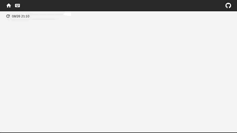
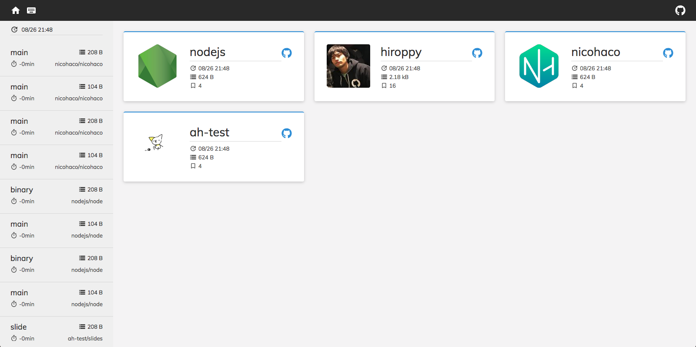
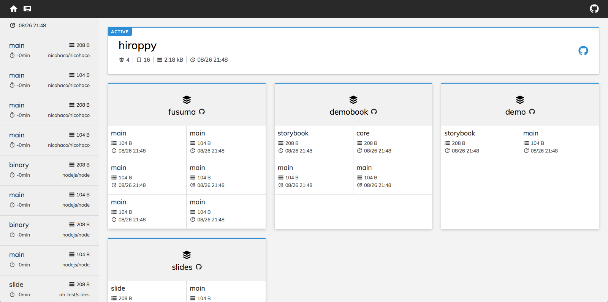

<div align="center">
  
</div>

[](https://travis-ci.org/hiroppy/demobook)

## Introduction

**DemoBook will help the development environment of your work!!**

DemoBook is an application to easily deploy static files and provides CLI and Server.

### Usage

- It is possible to support a review of PR by making CI execute CLI.
  - Automatically deploys production deliverables(also, like storybook, bundle.js, etc...) to the DemoBook server hosted by a user when CI runs, and then a registered bot notifies PR.
- It is possible to deploy instantly anywhere
  - A team member can deploy from each PC without to push to GitHub with 1 command and can easily share to team members

## Feature

- The server can publish random URLs for deployed static files
- The server can post as a bot to GitHub's PR
- The server can delete expired static files automatically
- The CLI does not matter where you run

## Demo



### Top Page



### Owner Page



## Getting Started

We need to prepare the DemoBook server.

```sh
$ git clone git@github.com:hiroppy/demobook.git && cd demobook && npm i && cd packages/app
$ cp .env.sample .env # please edit it
$ npm run build:client:prod
$ openssl req -x509 -newkey rsa:2048 -nodes -sha256 -subj '/CN=localhost' \
  -keyout key.pem -out cert.pem # if you need
$ docker-compose -f docker-compose.yml -f docker-compose.prod.yml up -d
```

### Use a bot and automatically writes some information as a comment in PR

It is beneficial to register the CLI as a task in CI.  
DemoBook can notify GitHub by specifying the `--pr` option of the CLI.  
You need to write `userName` and `password` in `.env`.

> the format that a bot posts: [#4](https://github.com/hiroppy/demobook/issues/4#issuecomment-416006087)

This is a sample of how to write in Travis.

<details>

```yml
# travis.yml
sudo: false
language: node_js
cache:
  directories:
    - node_modules
node_js:
  - 10
os:
  - linux
before_script:
  - npm i
  - npm run build
  - npx @demobook/cli -o onwer-name -r repo-name -t https://your-domain -d dist --pr ${TRAVIS_PULL_REQUEST} -n core
```

</details>

It can be executed locally as well.

## Development

```sh
$ git clone git@github.com:hiroppy/demobook.git && cd demobook && npm i && cd packages/app
$ cp .env.sample .env # please edit it
$ docker-compose up
$ # if you want to create demos...
$ cd ../examples
$ sh local.sh # please edit local.sh(owner name, repository name)
```

## Respect

Respect the UA of [drone.io](https://drone.io/).
